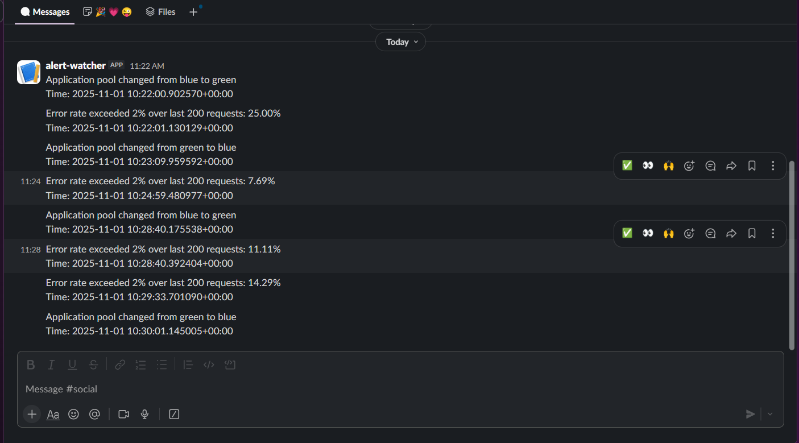

## hng-stage-two — Blue/Green Docker Compose example

This repository demonstrates a simple blue/green deployment pattern using Docker Compose and an Nginx front-end.

### Services

- `blue` — application container mapped to host port 8081
- `green` — application container mapped to host port 8082
- `nginx` — Nginx reverse proxy mapped to host port 8080 that forwards traffic to the active upstream

### Files

- `docker-compose.yaml` — defines the three services and the `app_network` bridge network.
- `nginx.conf.template` — Nginx configuration template used by the `nginx` service. The template expects environment variables to be substituted before Nginx starts.
- `.env.example` — example environment variables for local development. Copy this to `.env` and edit as needed.

### Environment variables

```bash
cp .env.example .env
# edit .env to set BLUE_IMAGE, GREEN_IMAGE, ACTIVE_POOL, PORT, etc.
```

Key variables in `.env`:

- `BLUE_IMAGE` / `GREEN_IMAGE` — Docker images used for the blue/green app containers.
- `RELEASE_ID_BLUE` / `RELEASE_ID_GREEN` — release identifiers (passed into app containers as env vars).
- `PORT` — port the app listens on _inside_ the app container (this value is substituted into the Nginx template).
- `ACTIVE_POOL` — either `blue` or `green`. The `nginx` service uses this value at startup to decide which backend is primary.

### How it works

- The `nginx` service runs a shell command at startup that sets the `PRIMARY` and `BACKUP` environment variables based on the value of `ACTIVE_POOL`, then uses `envsubst` to substitute these (and `PORT`) into the Nginx config template:

	```bash
	/bin/sh -c "
		if [ \"$ACTIVE_POOL\" = 'blue' ]; then
			export PRIMARY=app_blue; export BACKUP=app_green;
		else
			export PRIMARY=app_green; export BACKUP=app_blue;
		fi;
		envsubst '\$PORT \$PRIMARY \$BACKUP' < /etc/nginx/nginx.conf.template > /etc/nginx/nginx.conf &&
		nginx -t;
		nginx -g 'daemon off;'
	"
	```

- The `nginx.conf.template` uses `${PRIMARY}` and `${BACKUP}` to define the upstream servers. This ensures the correct pool is always primary, and the other is backup, with no shell expressions left in the config.

### Traffic flow

1. Client requests -> host port 8080 -> Nginx
2. Nginx proxies to the upstream backend using the primary server selected via `ACTIVE_POOL` and a configured backup server

### Quickstart — run locally

1. Copy and edit environment variables:

		```bash
		cp .env.example .env
		# edit .env
		```

2. Start all services:

		```bash
		docker compose up -d
		```

3. Visit the app at:

		http://localhost:8080

4. View logs:

		```bash
		docker compose logs -f nginx
		docker compose logs -f blue
		docker compose logs -f green
		```

5. Stop and remove containers:

		```bash
		docker compose down
		```

### Switching the active pool

To change which pool is primary (blue or green):

1. Update `ACTIVE_POOL` in your `.env` (set to `blue` or `green`).
2. Recreate the `nginx` service so the new environment value is picked up and the template is re-rendered. For example:

		```bash
		docker compose up -d --no-deps --force-recreate nginx
		```

This recreates the `nginx` container with the updated `ACTIVE_POOL` and re-renders `nginx.conf` using `envsubst`.

> **Note:** A simple `docker compose restart nginx` will not pick up changed environment variables. You must recreate the container as above.

### Troubleshooting

- If Nginx cannot reach the app containers, confirm the `PORT` in `.env` matches the port the app inside the image listens on.
- Ensure Docker can pull the images named in `BLUE_IMAGE` and `GREEN_IMAGE` or that they exist locally.

### Testing and Monitoring

#### Testing endpoints

Check application health:
```bash
curl http://localhost:8080/version
# Should return: {"status":"OK","message":"Application version in header"}
```

Control chaos testing:
```bash
# Start error simulation
curl -X POST http://localhost:8080/chaos/start?mode=error
# Returns: {"message":"Simulation mode 'error' activated"}

# Stop chaos simulation
curl -X POST http://localhost:8080/chaos/stop
# Returns: {"message":"Simulation stopped"}
```

#### View logs and monitor failover

View Nginx logs (includes failover events and error rates):
```bash
sudo docker logs nginx
# or follow logs
sudo docker logs -f nginx
```

#### Slack notifications

The watcher service monitors Nginx logs and sends alerts to Slack when:
- Application pool changes (failover events)
- Error rate exceeds threshold (default 2% over 200 requests)

To enable Slack notifications:
1. Create a Slack app and get a webhook URL for your workspace
2. Add the webhook URL to your `.env`:
   ```
   SLACK_WEBHOOK_URL="https://hooks.slack.com/services/YOUR/WEBHOOK/URL"
   ```

Example alerts are shown below:



See `runbook.md` for detailed incident response procedures.


